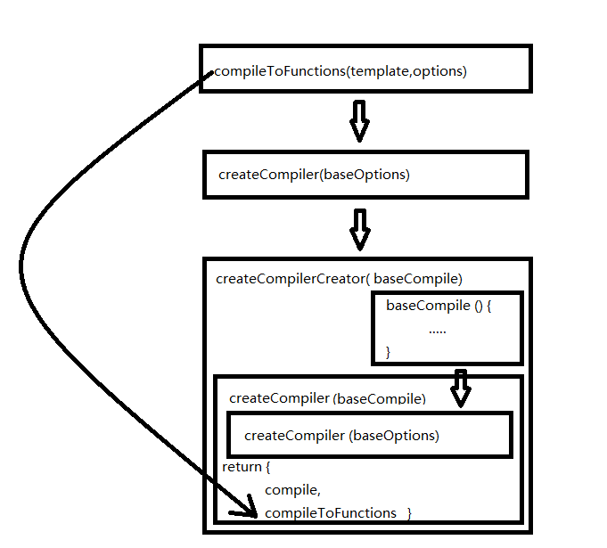

## template 与 render
在使用vue的时候，我们有两种方式来创建我们的HTML页面，第一种情况，也是大多情况下，我们会使用模板template的方式，因为这更易读易懂也是官方推荐的方法；第二种情况是使用render函数来生成HTML，它比template更接近编译器，这也对我们的JavaScript的编程能力要求更高。

实际上使用render函数的方式会比使用template的效率更高，因为vue会先将template编译成render函数，然后再走之后的流程，也就是说使用template会比render多走编译成render这一步，而这一步就是由我们的compiler来实现的啦，本节讲述的就是vue源码中的编译器compiler，它是如何一步步将template最后转换为render。

## $mount小插曲

由于在vue实例的那一篇我漏掉了`$mount`的具体实现，而理解`$mount`的流程也会帮助我们更好地引入`compiler`，那我们就快速地看看`$mount`吧~（假如觉得只想看编译部分的同学可以跳过这一段哦~ ）

### entry-runtime-with-compiler.js
```
const mount = Vue.prototype.$mount
Vue.prototype.$mount = function (
  el?: string | Element,
  hydrating?: boolean
): Component {
  el = el && query(el)

  /* istanbul ignore if */
  if (el === document.body || el === document.documentElement) {
    process.env.NODE_ENV !== 'production' && warn(
      `Do not mount Vue to <html> or <body> - mount to normal elements instead.`
    )
    return this
  }

  const options = this.$options
  // 没有render时将template转化为render
  if (!options.render) {
    let template = options.template

    // 有template
    if (template) {
      // 判断template类型（#id、模板字符串、dom元素）
      // template是字符串
      if (typeof template === 'string') {
        // template是#id
        if (template.charAt(0) === '#') {
          template = idToTemplate(template)
          /* istanbul ignore if */
          if (process.env.NODE_ENV !== 'production' && !template) {
            warn(
              `Template element not found or is empty: ${options.template}`,
              this
            )
          }
        }
      // template是dom元素
      } else if (template.nodeType) {
        template = template.innerHTML
      } else {
        // 无效template
        if (process.env.NODE_ENV !== 'production') {
          warn('invalid template option:' + template, this)
        }
        return this
      }
    // 无template
    } else if (el) {
      // 如果 render 函数和 template 属性都不存在，挂载 DOM 元素的 HTML 会被提取出来用作模板
      template = getOuterHTML(el)
    }

    // 执行template => compileToFunctions()
    if (template) {
      /* istanbul ignore if */
      if (process.env.NODE_ENV !== 'production' && config.performance && mark) {
        mark('compile')
      }
      const { render, staticRenderFns } = compileToFunctions(template, {
        shouldDecodeNewlines,
        shouldDecodeNewlinesForHref,
        delimiters: options.delimiters,
        comments: options.comments
      }, this)
      options.render = render
      options.staticRenderFns = staticRenderFns

      /* istanbul ignore if */
      if (process.env.NODE_ENV !== 'production' && config.performance && mark) {
        mark('compile end')
        measure(`vue ${this._name} compile`, 'compile', 'compile end')
      }
    }
  }
  // 有render
  return mount.call(this, el, hydrating)
}
```
整体流程：
- 用一个变量`mount`把原来的`$mount`方法存起来，再重写`$mount`方法
- 然后对`el`进行处理，`el`可以是dom节点或者是节点的选择器字符串，若是后者的话在通过`query(el)`进行转换
- `el`不能是`html`或者`body`元素（也就是说不能直接将vue绑定在`html`或者`body`标签上）
- 若没有`render`函数
    - 若有`template`，判断`template`类型（#id、模板字符串、dom元素）
    - 若`render`函数和`template`都不存在，挂载DOM元素的HTML会被提取出来用作`template`
    - 执行`template => compileToFunctions()`，将`template`转换为`render`
- 若有`render`函数
    - 走原来的`$mount`方法

这里就证明了使用`template`的话还是会先转换为`render`再进行下一步的操作，我们接着看下一步发生了什么吧~

### runtime/index.js

上一个文件中的vue是来自这里的，我们在这里可以看到

```
Vue.prototype.$mount = function (
  el?: string | Element,
  hydrating?: boolean
): Component {
  el = el && inBrowser ? query(el) : undefined
  return mountComponent(this, el, hydrating)
}
```
可以看出这个`$mount`方法返回的是`mountComponent`这个方法，我们又继续找找

### instance/lifecycle.js

原来`mountComponent`是在`lifecycle.js`中，兜兜转转我们又回到了实例的这一块来~
```
export function mountComponent () {
  vm.$el = el
  if (!vm.$options.render) {
    vm.$options.render = createEmptyVNode
  }
  callHook(vm, 'beforeMount')

  let updateComponent = () => {
      vm._update(vm._render(), hydrating)
    }
  }

  vm._watcher = new Watcher(vm, updateComponent, noop)
  hydrating = false
  
  if (vm.$vnode == null) {
    vm._isMounted = true
    callHook(vm, 'mounted')
  }
  return vm
}
```
这里的操作就是在调用`beforeMount`钩子前检查选项里有没有`render`函数，没有的话我们就给它建个空的，然后我们执行`vm._update(vm._render(), hydrating)`，再用`watcher`进行数据绑定，然后调用`mounted`钩子。关于`_update`和`_render`的实现我们先卖个关子~ 等我们学到虚拟dom实现的时候再看。

## compiler 整体流程

前面搞了这么多前戏，终于开始讲compiler了~ 还记得刚提到重写的`$mount`方法吗，里面将`template`转换为`render`是通过`compileToFunctions`方法实现的，我们看看他的来头，之后的逻辑会有点绕但是不难理解，提醒~~~~ 对于绕来绕去的源码有一个好的方法就是写demo + 打断点！根据你的需求去打断点看一下输出的内容是否符合你的预期，这会对你理解源码很有帮助哦，在后面的学习中我们也会用例子去分析~~~ 跟随着`compileToFunctions`的源头，我们走起！~

### platforms/web/compiler/index.js
```
const { compile, compileToFunctions } = createCompiler(baseOptions)
```
### src/compiler/index.js
```
export const createCompiler = createCompilerCreator(function baseCompile () {
  ...
})
```
### src/compiler/create-compiler.js
```
export function createCompilerCreator (baseCompile){
  return function createCompiler (baseOptions) {
    function compile (template, options) {
      const finalOptions = Object.create(baseOptions)

      // merge
      if (options) {
        // merge custom modules
        if (options.modules) {
          finalOptions.modules =
            (baseOptions.modules || []).concat(options.modules)
        }
        // merge custom directives
        if (options.directives) {
          finalOptions.directives = extend(
            Object.create(baseOptions.directives),
            options.directives
          )
        }
        // copy other options
        for (const key in options) {
          if (key !== 'modules' && key !== 'directives') {
            finalOptions[key] = options[key]
          }
        }
      }

      // finalOptions 合并 baseOptions 和 options
      const compiled = baseCompile(template, finalOptions)
      return compiled
    }

    return {
      compile,
      compileToFunctions: createCompileToFunctionFn(compile)
    }
  }
}

```

呼~一下子贴这么多代码，好怕被打，我们可以先把路找着，具体代码再慢慢看。
`createCompilerCreator`是个高阶函数，接受一个函数`baseCompile`，返回了一个函数`createCompiler`，`createCompiler`函数里又有一个`compile`函数，里面调用了`baseCompile`和最初传入的`baseOptions`，最后返回`compile`函数和`compileToFunctions`函数。emmm...有点乱呵，我画个图给你们将就着看吧。。。



我们先看`create-compiler.js`中的`createCompilerCreator`函数中的`createCompiler`函数中的`compile`函数中（好累。。。）：

先是将参数`baseOptions`和传入的`options`进行合并得到`finalOptions`，再进行最关键一步（终于！）：`const compiled = baseCompile(template, finalOptions)`。

而`baseCompile`函数就是最外层`createCompilerCreator`函数的一个参数，这个关键的流程我们等下就看，我们先继续，由`baseCompile`得到了我们想要的结果`compiled`，再返回给上一个函数`createCompiler`，在`return`中有我们要的一个函数，就是我们最开始调用的`compileToFunctions`，原来他就是通过一个函数将我们的`compile`结果转换为`compileToFunctions`。

我们去看看这个转换函数`createCompileToFunctionFn`，然后对比一下转换前后两者的差别。在`src/compiler/to-function.js`
文件中，我就不贴代码了，你们自己对着源码看吧，我说一下里面主要完成的操作就是执行了`compile`函数得到原来的值再进行转化，再将其存进缓存中。

而原`compile`返回的结构是：
```            
{
    ast,
    render,
    staticRenderFns
}
```
经过转化后没有了`ast`,而且将`render`和`staticRenderFns`转换为函数的形式：
```
{
    render,
    staticRenderFns
}
```
看完了整体流程，我们看回很关键的函数`baseCompile`

### baseCompile

```
function baseCompile (template, options) {
  const ast = parse(template.trim(), options)
  optimize(ast, options)
  const code = generate(ast, options)
  return {
    ast,
    render: code.render,
    staticRenderFns: code.staticRenderFns
  }
}
```

其实这个函数很短但是阐述了我们编译的全过程

`parse -> optimize -> generate`

step 1 ：先对`template`进行`parse`得到抽象语法树`AST`

step 2 ：将`AST`进行静态优化

step 3 ：由`AST`生成`render`

返回的格式就是
```
{
    ast,
    render: code.render,
    staticRenderFns: code.staticRenderFns
}
```

最后我放上来自web平台中的baseOptions的配置含义，方便你们以后看源码可以查询

```
{
  expectHTML: true, // 是否期望HTML，不知道是啥反正web中的是true
  modules, // klass和style，对模板中类和样式的解析
  directives, // v-model、v-html、v-text
  isPreTag, // v-pre标签
  isUnaryTag, // 单标签，比如img、input、iframe
  mustUseProp, // 需要使用props绑定的属性，比如value、selected等
  canBeLeftOpenTag, // 可以不闭合的标签，比如tr、td等
  isReservedTag, // 是否是保留标签，html标签和SVG标签
  getTagNamespace, // 命名空间，svg和math
  staticKeys: genStaticKeys(modules) // staticClass,staticStyle。
}
```

这三个步骤在接下来的文章里我们会进行更详细的分析~对于compiler的概念和整体的流程都基本讲完啦，谢谢你们的支持，如有分析错误之处可以随意提出来，我们一起探讨探讨~ 
